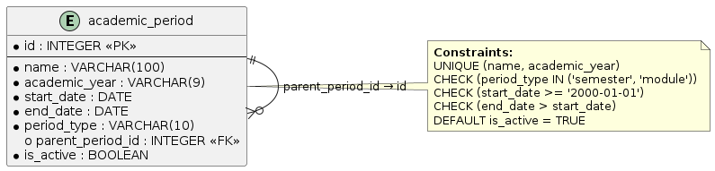

# Вариант №20. Сервис учебных периодов (Academic Period)

## Добавить учебный период

### Информация, требуемая для создания учебного периода

| Параметр | Обязательность | Тип | Ограничение | Значение по умолчанию |
|----------|---------------|-----|-------------|----------------------|
| name | Обязательно | Строка | 1..100 символов | – |
| academic_year | Обязательно | Строка | Формат 2024-2025 | – |
| start_date | Обязательно | Дата | Не ранее 2000-01-01 | – |
| end_date | Обязательно | Дата | Больше start_date | – |
| period_type | Обязательно | Строка | semester, module | semester |
| parent_period_id | Необязательно | Целое | 0 – для семестра, ID семестра – для модуля | 0 |

**Уникальная комбинация параметров:** `name` и `academic_year`

### Выходные данные

| Параметр | Тип |
|----------|-----|
| id | Целое |
| name | Строка |
| academic_year | Строка |
| start_date | Дата |
| end_date | Дата |
| period_type | Строка |
| parent_period_id | Целое |

---

## Изменить учебный период по ID

### Входные параметры

| Параметр | Обязательность | Тип | Ограничение | Значение по умолчанию |
|----------|---------------|-----|-------------|----------------------|
| name | Необязательно | Строка | 1..100 символов | – |
| academic_year | Необязательно | Строка | Формат 2024-2025 | – |
| start_date | Необязательно | Дата | Не ранее 2000-01-01 | – |
| end_date | Необязательно | Дата | Больше start_date | – |
| period_type | Необязательно | Строка | semester, module | – |
| parent_period_id | Необязательно | Целое | 0 – для семестра, ID семестра – для модуля | – |

### Выходные данные

| Параметр | Тип |
|----------|-----|
| id | Целое |
| name | Строка |
| academic_year | Строка |
| start_date | Дата |
| end_date | Дата |
| period_type | Строка |
| parent_period_id | Целое |

---

## Удалить учебный период по ID

### Выходные данные

| Параметр | Тип | Описание |
|----------|-----|----------|
| result | Логический | True – если запись удалена, False – если запись не найдена или есть дочерние модули |

> Примечание: удаление невозможно, если у периода есть дочерние модули.

---

## Получить учебный период по ID

### Выходные данные

| Параметр | Тип |
|----------|-----|
| id | Целое |
| name | Строка |
| academic_year | Строка |
| start_date | Дата |
| end_date | Дата |
| period_type | Строка |
| parent_period_id | Целое |

---

## Получить список учебных периодов по заданным параметрам

### Входные параметры

| Параметр | Тип | Описание |
|----------|-----|----------|
| academic_year | Строка | Фильтр по учебному году |
| period_type | Строка | semester, module |
| name_contains | Строка | Поиск по части имени |
| parent_period_id | Целое | Фильтр по родительскому периоду (0 – корневые) |

### Выходные данные (список)

| Параметр | Тип |
|----------|-----|
| id | Целое |
| name | Строка |
| academic_year | Строка |
| start_date | Дата |
| end_date | Дата |
| period_type | Строка |
| parent_period_id | Целое |

---

## ER-диаграмма

---

## Пример данных

| id | name | academic_year | period_type | start_date | end_date | parent_period_id |
|----|------|---------------|-------------|------------|----------|------------------|
| 1 | Осенний семестр | 2025-2026 | semester | 2025-09-01 | 2025-12-31 | 0 |
| 2 | Модуль 1 | 2025-2026 | module | 2025-09-01 | 2025-10-15 | 1 |
| 3 | Модуль 2 | 2025-2026 | module | 2025-10-16 | 2025-12-15 | 1 |
| 4 | Весенний семестр | 2025-2026 | semester | 2026-02-07 | 2026-05-30 | 0 |
| 5 | Модуль 3 | 2025-2026 | module | 2026-02-07 | 2026-03-25 | 4 |

---

## Ограничения

- `start_date <= end_date`
- `period_type` может быть только `semester` или `module`
- Для семестров `parent_period_id = 0`
- Для модулей `parent_period_id > 0` и ссылается на существующий семестр
- Уникальность: `(academic_year, name)`
- Все поля NOT NULL
